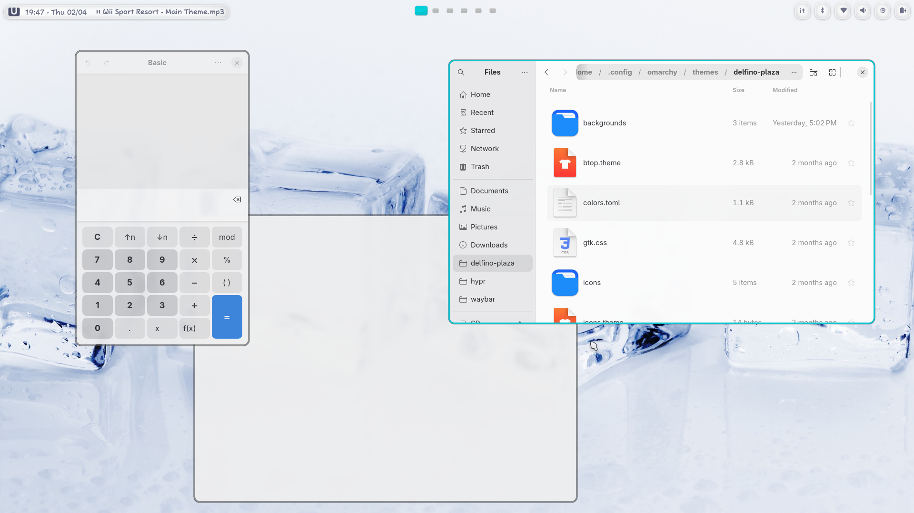

# Delfino Plaza
A Hyprland (Omarchy) Wii/Wii U-inspired theme.

> [!IMPORTANT]
> Delfino plaza is my personal set up for Omarchy and Hyprland.
> The files you will find here are just the configurations. You still have to have a pretty good knowledge of how Omarchy and Hyprland are structured to implement this.
> You have to set up the theme, the cursors, the icons, the waybar and so on.

Delfino Plaza is a nostalgic yet functional desktop theme inspired by the **Frutiger Aero** aesthetic and the visual identity of **Nintendo's Wii and Wii U** era. Think glossy surfaces, soft blues, bubbly UI elements, and that warm early-2000s optimism, all running on a modern Hyprland setup.

This theme is assembled from various sources across the community. The Waybar icons are custom-made by me. It uses the **Comix** cursor theme, **Reversal-Blue** icons for the file manager and system UI, and original **Nintendo fonts** to complete the look.
